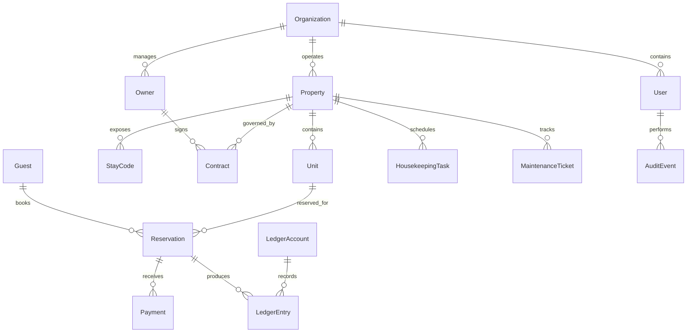

# ERD lógico inicial

Este modelo es una base conceptual para orientar Fase 1 y Fase 2. No representa todavía migraciones definitivas.

## Principios

- El Código de Estancia localiza una propiedad, pero no es una credencial de seguridad.
- El ledger financiero debe ser append-only.
- La participación de propietario/KUQUBA debe vivir en contrato o configuración, no en código.
- El dominio no debe depender directamente de proveedores de pagos, OTA, FEL, WhatsApp o storage.
