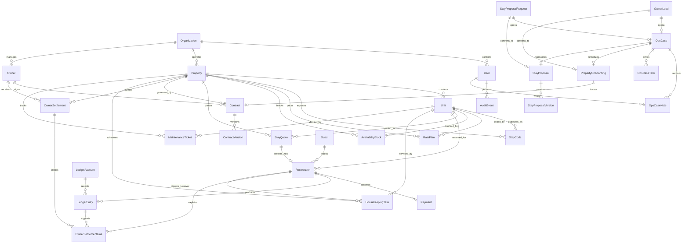

# ERD lógico inicial

Este modelo es una base conceptual para orientar Fase 1 y Fase 2. No representa todavía migraciones definitivas.

## Principios

- El Codigo de Estancia localiza una propiedad/unidad publica, pero no es una credencial de seguridad.
- El ledger financiero debe ser append-only.
- `OwnerSettlement` es una proyeccion por periodo para el propietario; sus lineas referencian ledger/reservas sin sustituir el libro mayor.
- `ContractVersion` conserva el snapshot emitido; la aceptacion owner escribe evidencia y no reescribe versiones firmadas.
- La participación de propietario/KUQUBA debe vivir en contrato o configuración, no en código.
- El dominio no debe depender directamente de proveedores de pagos, OTA, FEL, WhatsApp o storage.
- `OpsCase` concentra seguimiento interno y no sustituye las entidades publicas de origen.
- `PropertyOnboarding` y `StayProposal` son flujos formales creados desde ops, no formularios publicos.
- `StayQuote` calcula disponibilidad y tarifa sin bloquear inventario; un hold temporal crea `Reservation(HOLD)` hasta pago o confirmacion.
- `Payment` registra adapter, referencia, estado y expiracion del checkout; la confirmacion genera ledger base sin acoplar el dominio a un proveedor real.
- `HousekeepingTask` y `MaintenanceTicket` separan operacion en campo de tareas comerciales/owner; sus cambios de estado se auditan desde Ops.
